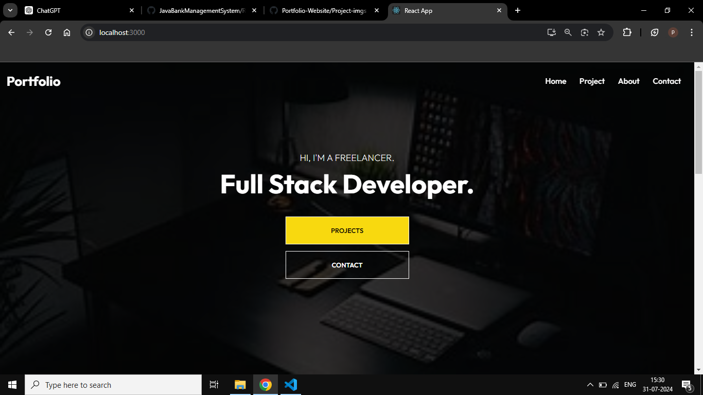
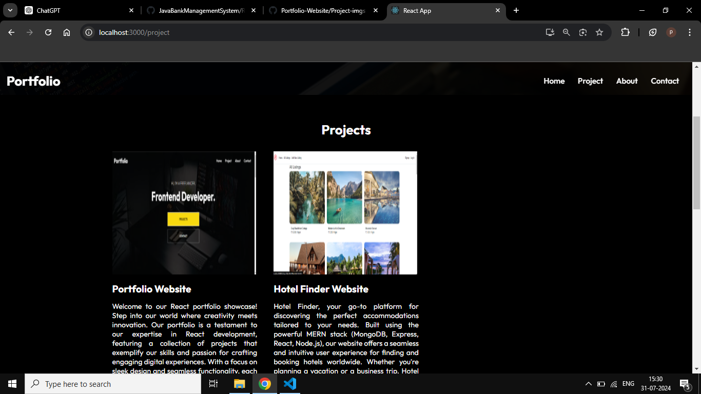
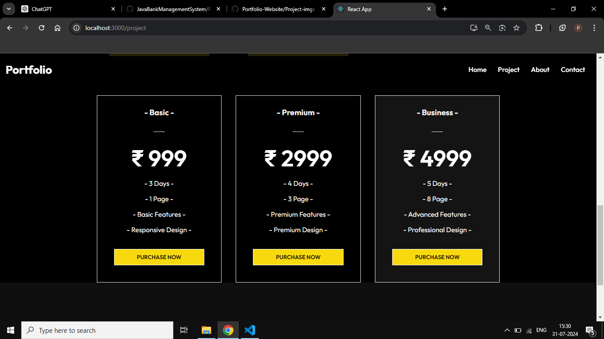
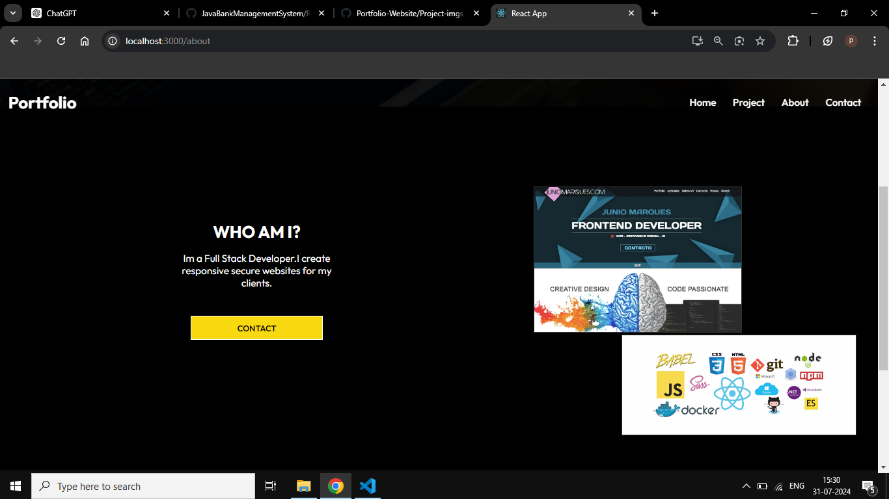
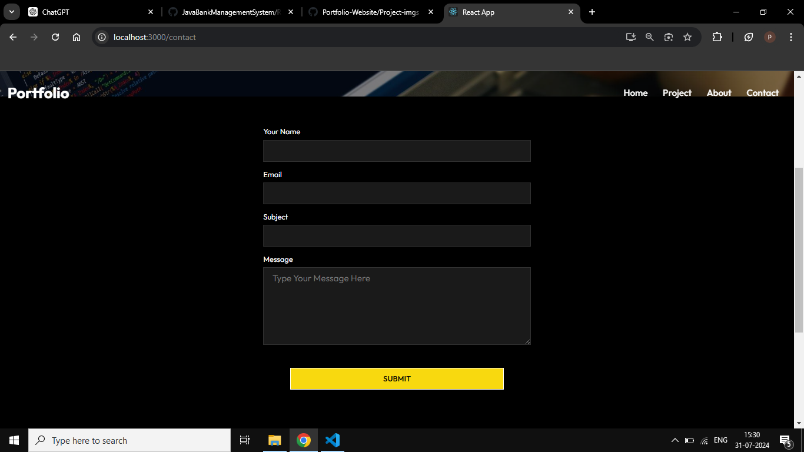

# Hotel Finder Website

## Overview

This repository contains the source code for my personal portfolio website, built using React.js. The website showcases my projects, skills, and experience as a web developer. It is designed to provide visitors with an engaging and interactive experience.## Features

1. **Responsive Design:**
   - The website is fully responsive and optimized for all devices, ensuring a seamless experience on desktops, tablets, and smartphones.

2. **Project Showcase:**
   - Displays a curated list of my projects, each with a detailed description, technologies used, and links to live demos and source code.

## Prerequisites

- Html, Css, Bootstrap
- JavaScript
- React

1. Open the project in Visual Studio Code
2. Run Npm install
3. Run npm start
4. Open Browser and enter http://localhost:3000/

## Screenshots

## Feedback

I welcome your feedback! If you encounter any issues or have suggestions for improvement, please feel free to create an issue or reach out to the project me at samudraparth1@gmail.com.

Happy Coding!
